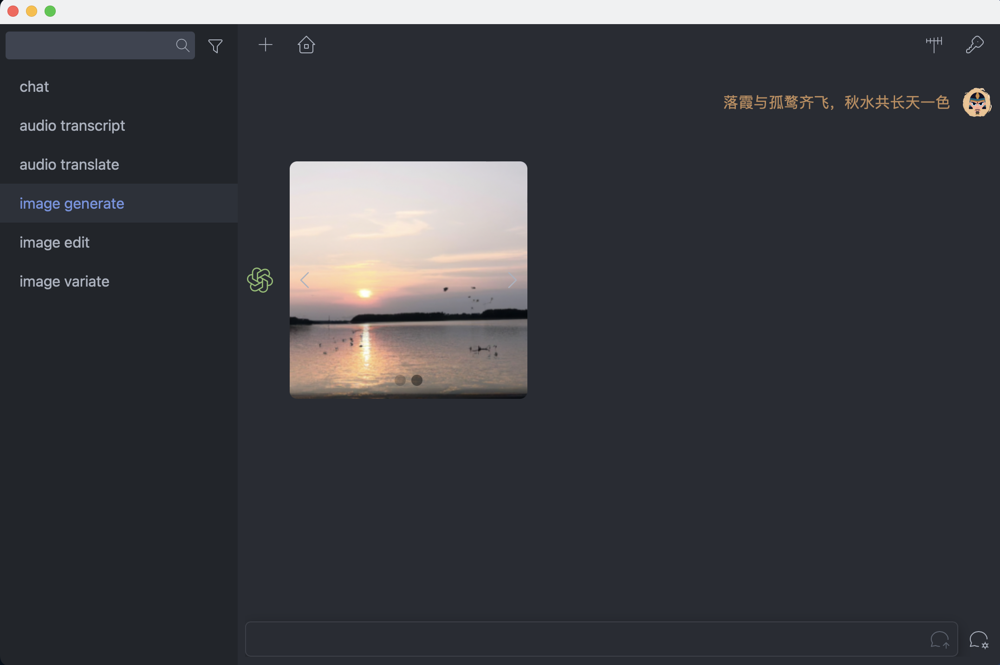

# Enki
A ChatGPT desktop application built with Tauri, Leptos, SQLx, and Tailwind. Support proxy, chat list and customizable parameters.

### Features
- [x] chat
- [x] image generation
- [x] image edits
- [x] image variations
- [x] audio transcriptions
- [x] audio translations



### Getting Started

```shell
# install tailwindcss
npm install -g tailwindcss

# install sass
npm install -g sass

# install nightly
rustup toolchain install nightly

# install wasm32
rustup target add wasm32-unknown-unknown

# install trunk
cargo install --locked trunk

# install tauri-cli
cargo install tauri-cli --version "^2.0.0-alpha"

# dev / build
cargo tauri dev / build
```
